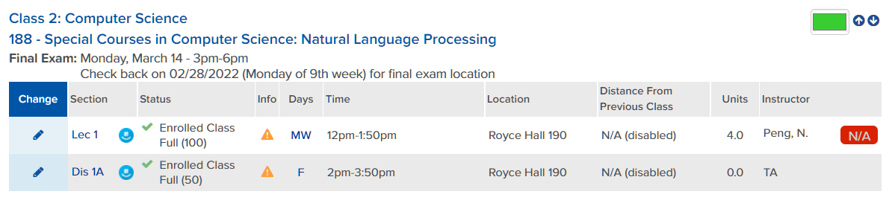
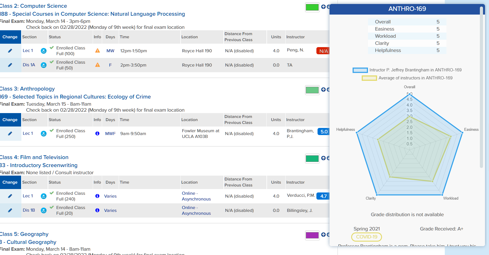

# Bruinwalk Popup Unit Test

## Test #1: HTML does not contain a div that has professor name
### Objective:
    We want to check whether the professor name is included in bruinwalk.com or not. Given that we search course name on bruinwalk, the professor's name must be there (unless the review of him/her does not exist yet)

### Input:
    url: (dummy HTML that does not contain any information about professor)
    
    <!DOCTYPE html>
    <html><body>
    <h1>My First Heading</h1>
    
My first paragraph.

    </body></html>

### Output:
    "" (empty string)

### Result:

## Test #2: Bruinwalk button for instructor whose review does not exist
### Objective:
    We would like to not create a popup for an instructor whose review does not exist on bruinwalk.com. Thus, after we parse instructor name and course, and after trying to match data from bruinwalk.com, we create N/A button instead.
### Note:
    This is a manual test instead of scripted since there are vanilla JS functions that does not support scripted test on Node.js
### Input:
    Course Name: COM-SCI-188
    Instructor: Peng, N.
### Output:
    Injected N/A button
### Result:

## Test #3: Popup does not show grade distribution if it does not exist on bruinwalk
### Objective:
    If an instructor grade distribution from previous years is not published, we do not want to create a chart of it.
### Note:
    This is a manual test instead of scripted since there are vanilla JS functions that does not support scripted test on Node.js
### Input:
    Course Name: ANTHRO-169
    Instructor: Brantingham, P.J.
### Output:
    Grade distribution div displays "Grade distribution is not available"
### Result:
