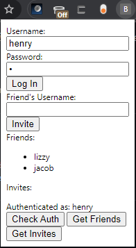
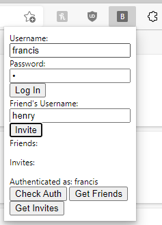
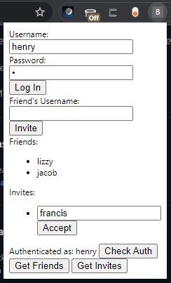
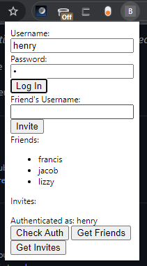

#  Basic API Request Testing

The following tests are performed by interacting with the prototype front end.

##  Step 1: A user logs in and views their friends

###  Objective:

After logging in and pressing the "Get Friends" and "Get Invites" buttons, the user should see a list of their current friends as well as who wants to be their friend.

###  Input:

Simply enter your username/password into the login form and press "Log In"

###  Expected Output:

---

## Step 2: Another user logs in and invites the first

### Objective:

A critical component of the friend system is social networking. This basic example should demonstrate the simplest case of sending a friend invite.

### Input:
Just enter your friend's name and hit "Invite"!

###  Expected Output:

---

## Step 3: User 1 views and accepts invite

### Object:
To protect users from spam and protect privacy, friend requests must be approved by the invited user. This scenario outlines what a user (currently) sees when another user sends them a friend request.

### Input:
Each invite will include your friend's name as well an individualized "Accept" button for that particular invitation. This button will send a request to the internal server confirming the friendship.

### Expected Output:

---

## Step 4: User 1 views new friends list

### Object:
This step shows the net change from a user's friends list as a culmination of the entire interaction. There are many different components working together as a part of this experience including interactions from multiple end users. A final end-to-end sanity check ensures that many internal components are working correctly.

### Expected Output:

