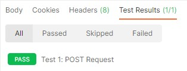
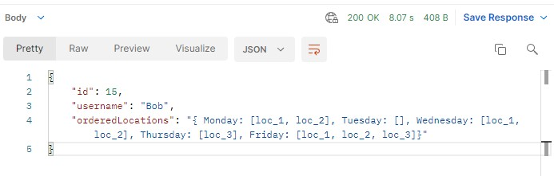
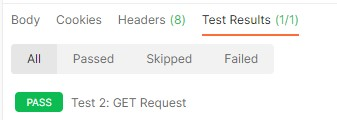
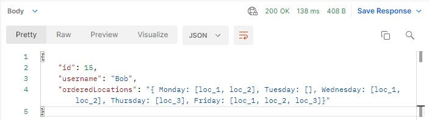
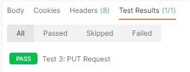
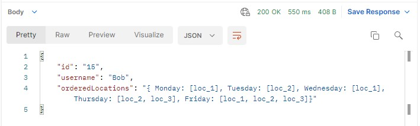

# Basic API Request Testing

    The following tests are performed by running the test scripts on [Postman](https://www.postman.com/)

## Test #1: POST Request
### Objective: 
    We want to ensure that after the timedistance module parses and constructs an ordered array of class locations, it can then send a POST request to our database to accurately initiate a student's data slot.
### Input:
    POST: https://bruin-map.herokuapp.com/api/studentInfo/
    BODY: (The javascript block below)
```Javascript
{
    "username": "Bob",
    "orderedLocations": "{ 
        Monday: [loc_1, loc_2], 
        Tuesday: [], 
        Wednesday: [loc_1, loc_2], 
        Thursday: [loc_3], 
        Friday: [loc_1, loc_2, loc_3]}
    "
}    
 ``` 

### Expected Output:
```Javascript 
{
    "id": 15,
    "username": "Bob",
    "orderedLocations": "{ 
        Monday: [loc_1, loc_2], 
        Tuesday: [], 
        Wednesday: [loc_1, loc_2], 
        Thursday: [loc_3], 
        Friday: [loc_1, loc_2, loc_3]
    }"
}

```
### Results:

  

---
## Test #2: GET Request
### Objective: 
    We want to ensure that the map website is able to send a GET Request to our database. The ordered array of class locations sent from the previously mentioned POST Request will be used by the site to generate a 3D routing map for the student.
### Input:
    GET: https://bruin-map.herokuapp.com/api/studentInfo/
### Expected Output:
```Javascript 
{
    "id": 15,
    "username": "Bob",
    "orderedLocations": "{ 
        Monday: [loc_1, loc_2], 
        Tuesday: [], 
        Wednesday: [loc_1, loc_2], 
        Thursday: [loc_3], 
        Friday: [loc_1, loc_2, loc_3]
    }"
}
```
### Results:

 

---
## Test #3: PUT Request
### Objective: 
    When a student adds or deletes a class from their Class Planner, the extension must be able to send a PUT Request to the database in order to properly update their ordered array of class locations. We don't want the student to view an outdated version of their routing map.
### Input:
    PUT: https://bruin-map.herokuapp.com/api/studentInfo/15
    BODY: (The javascript block below)

```Javascript
{
    "username": "Bob",
    "orderedLocations": "{ 
        Monday: [loc_1], 
        Tuesday: [loc_2], 
        Wednesday: [loc_1], 
        Thursday: [loc_2, loc_3], 
        Friday: [loc_1, loc_2, loc_3]}
    "
}    
```
### Expected Output:
```Javascript
{
    "id": "15",
    "username": "Bob",
    "orderedLocations": "{ 
        Monday: [loc_1], 
        Tuesday: [loc_2], 
        Wednesday: [loc_1], 
        Thursday: [loc_2, loc_3], 
        Friday: [loc_1, loc_2, loc_3]}
    "
}    
```

### Results:

